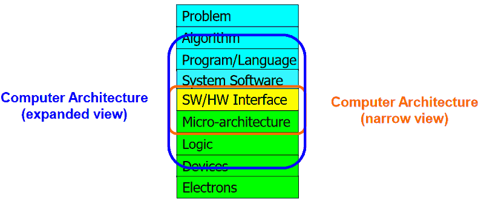
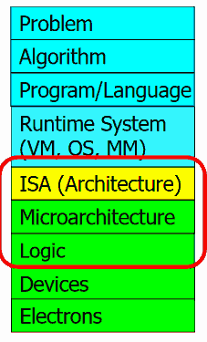

Lecture 01 - Introduction and Basics
====================================

Info
----

* `Video Link <http://www.youtube.com/watch?v=PMJxcArLU1E>`_
* `Lecture Slides <https://safari.ethz.ch/digitaltechnik/spring2018/lib/exe/fetch.php?media=digitaldesign-s18-lecture1-intro.pdf>`_

Reading
-------

* `In-Datacenter Performance Analysis of a Tensor Processing Unit <https://safari.ethz.ch/digitaltechnik/spring2018/lib/exe/fetch.php?media=indcperf.pdf>`_
* Chapter 1 in Harris & Harris
* Chapter 1-2 in Patt and Patel
* `Binary Numbers <https://safari.ethz.ch/digitaltechnik/spring2018/lib/exe/fetch.php?media=reading-week1_binarynumbers.pdf>`_
* `R.W. Hamming, "You and Your Research," Transcription of the Bell Communications Research Colloquium Seminar, 1986 <https://safari.ethz.ch/digitaltechnik/spring2018/lib/exe/fetch.php?media=youandyourresearch.pdf>`_
* `R.W. Hamming, "Numerical Methods for Scientists and Engineers,” 1962 <http://alvand.basu.ac.ir/~dezfoulian/files/Numericals/Numerical.Methods.For.Scientists.And.Engineers_2ed_Hamming_0486652416.pdf>`_
* `R.W. Hamming, "Error Detecting and Error Correcting Codes," Bell System Technical Journal, 1950 <https://safari.ethz.ch/digitaltechnik/spring2018/lib/exe/fetch.php?media=bstj29-2-147.pdf>`_

Reading Notes
^^^^^^^^^^^^^

Binary Numbers
""""""""""""""
* 1's complement toplarken carry'i LSB olarak eklemek sorunu çözüyorumuş.
  Bu açıdan düşünmemiştim.

Lecture Minutes
---------------

.. index::
    principled design
    ISA

* **29:00** Importance of principled design
* **40:00** "architecture based upon principle not upon precedent" (örnek, benzeri olan, geçmiş örnek). Mesela spectra ve meltdown'da precedent hızlı işlemci yapmaktı ama belki security principle'ı ile tekrar düşünülmeliydi.
* **44:00** zamanla teknoloji değişse de temel teknikler ve prensipler benzer kalabiliyor.
* **48:00** konu dışı olmasına rağmen örnek olarak **sytolic array**\ lerden bahsediyor. Bir parallel processing mimarisi sanırım. Google tensor tarafından kullanılıyormuş. https://www.geeksforgeeks.org/parallel-processing-systolic-arrays/ Memory BW açısından avantajlıymış.
* **01:03:00** Electrons → Transistors → Logic Gates → Combinational Logic Circuits → Sequential Logic Circuits (Storage Elements and Memory) → … → Cores → Caches → Interconnect → Memories → …
* **01:13:00** The transformation hierarcy

* **01:15:00** Algorithm is step-by-step procedure that is guarenteed to terminate where each step is precisely stated and can be carried out by a computer

.. _glossary-isa-first-defined:

**ISA**: Instruction Set Architecture, contract between HW and SW. Pgrammers assumption about HW.
**Microarchitecture**: An implementation of the ISA

* **01:24:00** VAX architecture, 3D array checking at hardware (?)

:term:`ISA` is sfdf fgfg

.. note::
    Test hebele

.. warning::
    Test

Glossary
--------

.. glossary::

    microarchitecture
        **Instruction Set Architecture**. It is a contract between Hardware and Software.
        It is programmers assumption about hardware. First defined :ref:`here<glossary-isa-first-defined>`.

    ISA
        Bu da iyi bir sey.

    ISAA
        iki AA li.

.. sectionauthor:: Alper Yazar <https://www.alperyazar.com>
.. sectionauthor:: Alper Yazmaz